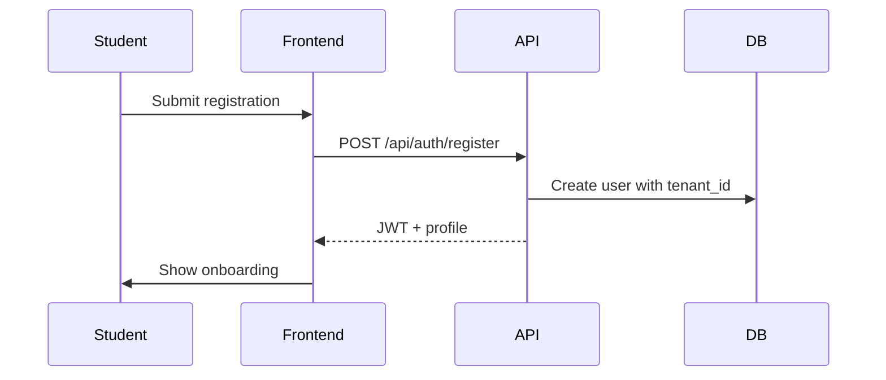
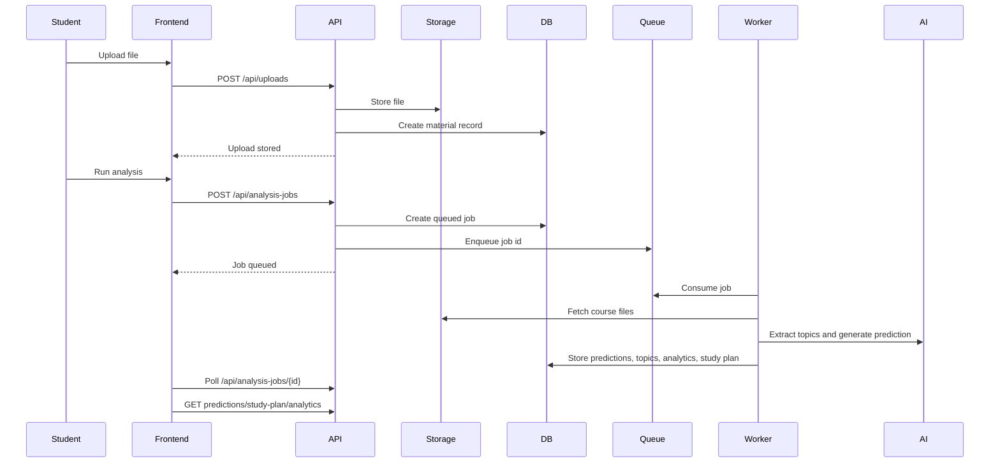

# ExamOracle AI Event Flows

## Registration Flow

## Upload And Analysis Flow

## AI Processing Pipeline

1. File uploaded.
2. OCR if required.
3. Text extraction.
4. Text cleaning.
5. Topic extraction.
6. Question classification.
7. Pattern analysis.
8. Probability scoring.
9. AI interpretation.
10. Prediction report persisted.

## Failure Handling

- Upload validation failures return `422`.
- Unsupported file types are rejected before storage.
- Analysis failures update `analysis_jobs.status = failed`.
- Worker errors are logged to `activity_logs`.
- Frontend displays backend-provided job state and errors.
