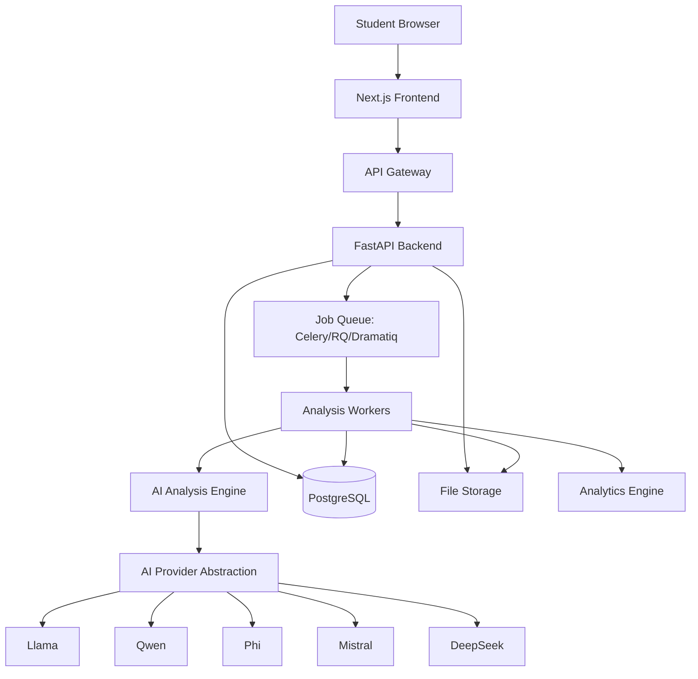
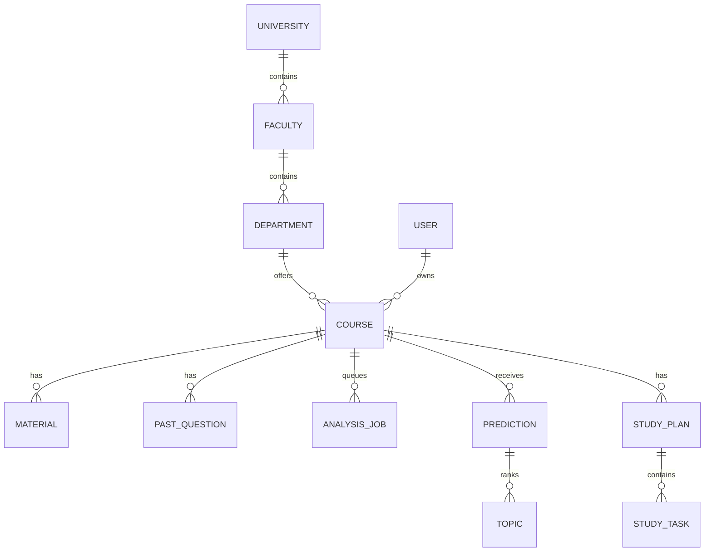

# ExamOracle AI System Architecture

## Product Boundary

ExamOracle AI is an AI analysis system for university exam preparation. The frontend is a client. The core product is the backend analysis engine that extracts text, detects topics, analyzes past-question patterns, scores probabilities, and generates study plans.

## Runtime Architecture

## Layer Responsibilities

### Next.js Frontend

- Authenticate users.
- Create courses through backend APIs.
- Upload files through backend APIs.
- Display analysis jobs, predictions, analytics, and study plans returned by backend.
- Render charts and responsive UI.
- Never extract text, score probabilities, classify questions, infer topics, or generate AI output.

### API Gateway

- Route requests to backend services.
- Enforce authentication, rate limits, request size limits, and audit logging.
- Provide stable public API paths.

### FastAPI Backend

- User and tenant management.
- Course management.
- Upload metadata and file routing.
- Analysis job creation.
- Queue orchestration.
- Prediction, analytics, and study plan APIs.
- Request validation and authorization.

### AI Analysis Engine

- OCR if required.
- Text extraction and cleaning.
- Topic extraction.
- Question classification.
- Pattern analysis.
- Frequency and probability scoring.
- LLM interpretation through provider abstraction.
- Prediction report generation.

### Storage

- PostgreSQL stores structured application state.
- Local storage is used for MVP file persistence under `/storage`.
- S3-compatible storage can replace local storage without changing domain services.

## Domain Model

## Multi-Tenant Rule

Every major entity must include `tenant_id` from the beginning:

- users
- courses
- materials
- past_questions
- predictions
- study_plans
- analysis_jobs
- activity_logs

This allows University A, B, and C to run on the same platform without a schema redesign.

## Frontend Compliance Rule

Every route/component must map to a backend capability:

- Auth UI -> `/api/auth`
- Course UI -> `/api/courses`
- Upload UI -> `/api/uploads`, `/api/materials`
- Predictions UI -> `/api/predictions`
- Planner UI -> `/api/study-plans`
- Analytics UI -> `/api/analytics`
- AI status UI -> `/api/ai`, `/api/analysis-jobs`

Frontend-only demo analysis is not permitted in production code.
